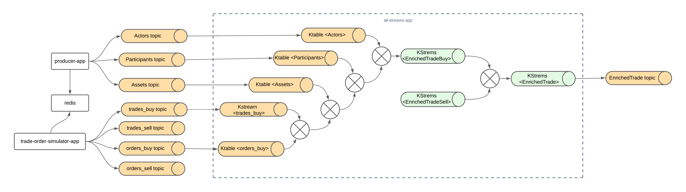
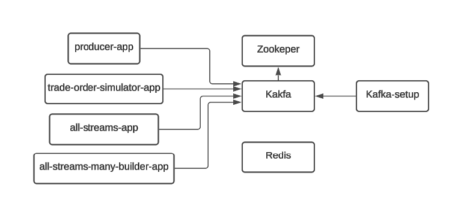

# Kafka Streams POC (Proof of Concept)

Esta es una prueba de concepto sobre el uso de kafka streams (DSL), sobre un caso de uso que involucra el enriquecimiento de mensajes (kafka) a partir de la union, agregación y mapeo de otros.

# Flujo streams general propuesto



# Componentes



* Kafka y Zookeper: Broker de mensajeria.
* Kafka-setup: Componente que crea los topicos automaticamente al iniciar.
* Redis: Almacenamiento de maximos de identificadores, para la simulación de los trades.
* producer-app: Aplicación para generar actors, assets y participants.
* trade-order-simulator-app: Aplicación para simular trades y orders.
* all-streams-app: Aplicación que ejecuta todas las operaciones con el streams, en un solo builder.
* all-streams-many-builder-app: Aplicación que ejecuta todas las operaciones con el streams, en 3 builder.


# Requisitos para ejecutar

* Docker
* Java 17
* Curl

# ¿Como ejecutar?

1. Ejecutar Proyecto:

Desde la raiz del proyecto, ejecutar la siguiente instrucción:

```
$ docker-compose up -d
```
Esto desplegara todo lo necesario: `kafka`, `kafka-ui`, `redis`, y las aplicaciones. Adicionalmente creara todos los topicos necesarios, desde la ejecución del contenedor `kafka-setup`, ejecutando los comando en `container-create-kafka-topics.sh`

2. Establecer información inicial para los topicos de `actors`, `participants`, `assets`:

Puede agregarse la cantidad que se requiera en el unica variable que recibe el metodo `total`.

```
$ curl -X POST "http://localhost:8082/participants?total=10000"
$ curl -X POST "http://localhost:8082/assets?total=10000"      
$ curl -X POST "http://localhost:8082/actors?total=10000"
```

3. Ejecutar simulación de `trades` y `orders`.

Puede agregarse la cantidad que se requiera en el unica variable que recibe el metodo `total`. Se creara igual cantidad de trades y orders tanto de venta como de compra.

```
$ curl -X POST "http://localhost:8083/trades?total=10000"
```

# Conclusiones
